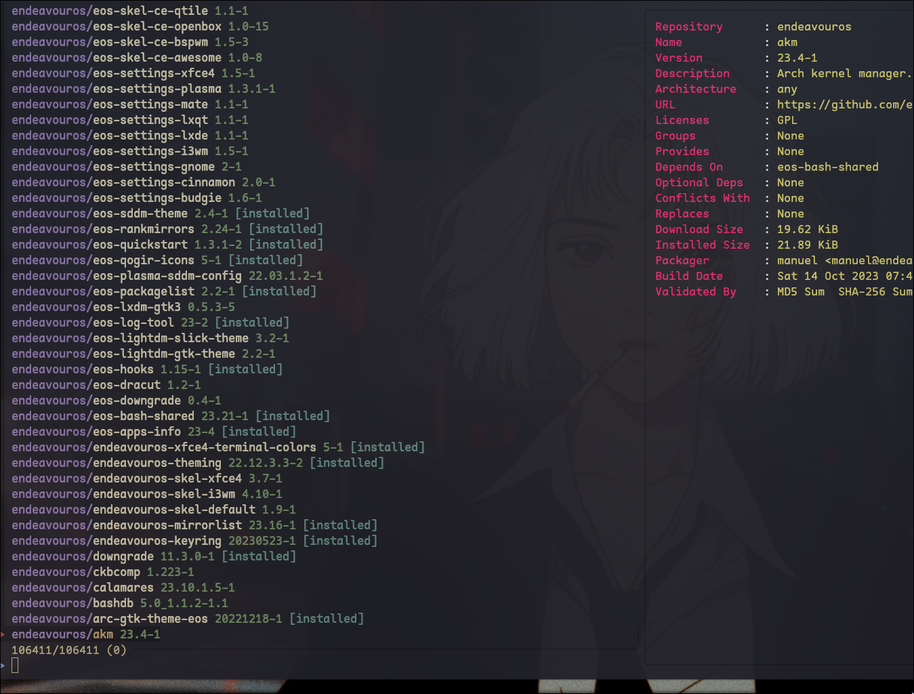

# Paruz
<p align="center">
  
</p>

Install and remove packages from the Arch repos and the AUR interactively
using Fzf. This is a rewrite of a bash script from <insert guys name>

## install packages from the AUR
<p align="center">
  
</p>

## Examples

paruz by default installs packages using "-S" just run `paruz` alone to browse
available packages.

install and update
```bash
  ./paruz -Syu
```

remove packages
```bash
  ./paruz -Rns
```

pass any options to paruz
```bash
  ./paruz -Syu --nocleanafter
```
